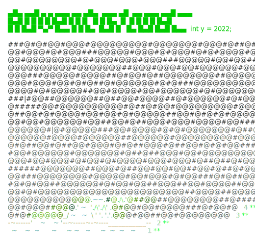

# Advent of Code (2022 - until I stop)
C# solutions to the Advent of Code problems.
Check out https://adventofcode.com.

<a href="https://adventofcode.com"></a>

## Thanks
**Thanks to David Nemeth** ([@encse](https://github.com/encse)) for the wonderful framework to download, scaffold, and easily run these puzzles. It removes the tedious non-programming aspects from solving these so that I can focus on consistently not reading the instructions properly :)

## About my solutions
I don't know how I missed AoC (Advent of Code) until now, but at least I found it eventually.

These are my solutions and I have no strong rules about how I complete them. Some are down and dirty for speed, which also reminds me of how that usually bites me in the butt. Maybe some will be great and well thought-out. 

### Why .net / DotNet / C#?
Certainly a [duck-typed language like Python](https://towardsdatascience.com/duck-typing-python-7aeac97e11f8) would be faster, but I want to [sharpen the saw](https://www.hanselman.com/blog/sharpen-the-saw-for-developers) with the language I use during the day. It's also an opportunity to experiment with different ways to use the framework and any new language features. It's like if solving sudoku puzzles could help you be better at your job. 


### Don't forget to use the watch command
If you don't use the `dotnet watch` command much, it's super handy here.

I run `dotnet watch run today` and it will keep re-running the program every time it notices a file has changed.

More from the original README
---
>You can browse my solutions as they are or fork the repo, remove everything >and use just the lib part to 
>start working on your own. The framework part is pretty stable and you get >testing, scaffolding etc for free.
>
>## Dependencies
>
>- This project is based on `.NET 7`  and `C# 11`. It should work on Windows, Linux and OS-X.
>- `AngleSharp` is used for problem download.
>
>## Running
>
>To run the project:
>
>1. Install .NET Core
>2. Clone the repo
>3. Get help with `dotnet run`
>```
>
>Usage: dotnet run [arguments]
>1) To run the solutions and admire your advent calendar:
>
> [year]/[day|all]      Solve the specified problems
> today                 Shortcut to the above
> [year]                Solve the whole year
> all                   Solve everything
>
> calendars             Show the calendars
>
>2) To start working on new problems:
>login to https://adventofcode.com, then copy your session cookie, and export 
>it in your console like this
>
> export SESSION=73a37e9a72a...
or `SET SESSION=73a37e9a72a...` on Windows
>
>then run the app with
>
> update [year]/[day]   Prepares a folder for the given day, updates the >input,
>                       the readme and creates a solution template.
> update today          Shortcut to the above.
>
>3) To upload your answer:
>set up your SESSION variable as above.
>
> upload [year]/[day]   Upload the answer for the selected year and day.
> upload today          Shortcut to the above.
>
>
>```
>
>## Working in Visual Studio Code
>If you prefer, you can work directly in VSCode as well. 
> 
> Open the command Palette (⇧ ⌘ P), select `Tasks: Run Task` then e.g. >`update today`.
>
> Work on part 1. Check the solution with the `upload today` task. Continue >with part 2.
>
> **Note:** this feature relies on the "Memento Inputs" extension to store >your session cookie, you need 
> to set it up in advance from the Command Palette with `Install Extensions`.
